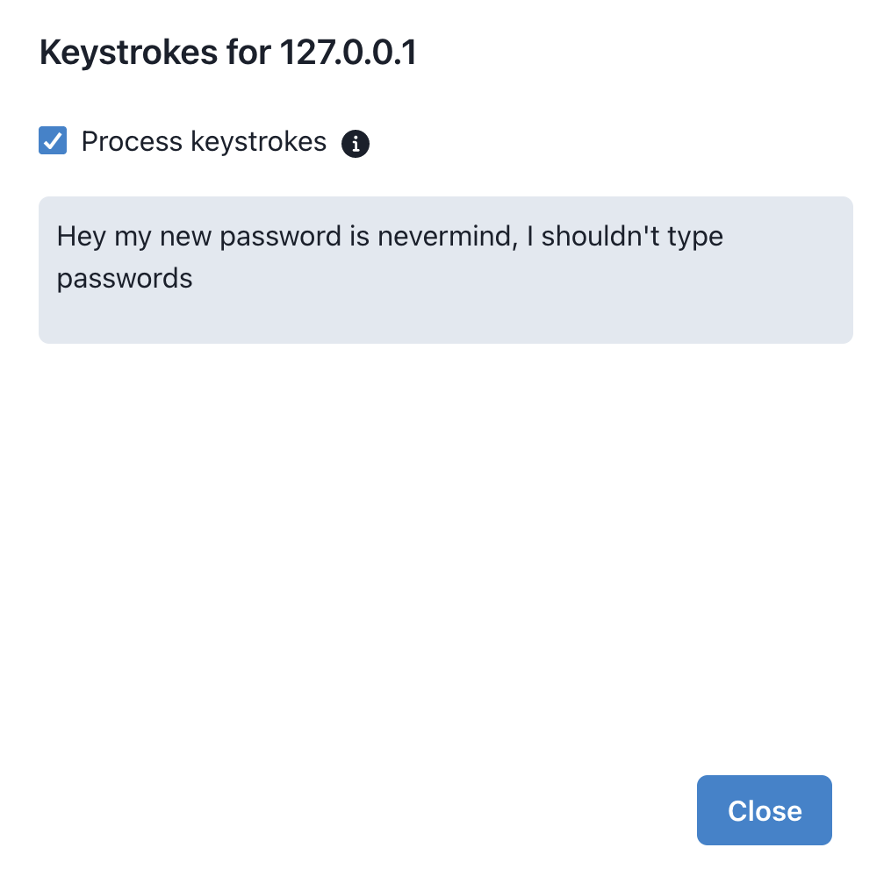

# React and Flask Keylogger App

This Proof-of-Concept application allows a user to create Cross-Site Scripting (XSS) payloads that can record keystrokes, steal cookies, etc.  Data exfiltrated with a XSS payload is sent to the server, where a user can view logs of recorded keystrokes and other data sent from the payload.

## App Setup

Run `docker-compose up --build` to set up the client and server, then go to `http://localhost:5173` to access the application.

## Basic App Usage

Register a username and password at `/register`.  Then login at `/login` with the new account.

The app has three pages: `Logs`, `Payloads`, and `Settings`.  The `Payloads` page lets a user create XSS payloads that will log keystrokes and grab cookies, local storage, and session storage, and then send this data back to the server.  Then this information can be viewed in the `Logs` page.  User settings can be updated in `Settings`.

## Logs Page

The `Logs` page displays recorded keystrokes sent from a XSS payload to the server.  Each log displays the host, time of log, User Agent, keystrokes, cookies, and storage data (local and session storage).  You can filter by host or a search term, which will search through the data.

You can also click a row to view the exfiltrated data details in a modal.  There's an option to process keystrokes, where `ENTER` characters will be converted to newlines, and for each `BACKSPACE`, a character will be deleted.  Below you can see an example of keystrokes before they've been processed and after.

<p float="left">
    
    
</p>

## Payloads Page

Here you can create and edit XSS payloads to use with the application.  A `Default XSS Payload` payload is included as an example.

The JavaScript payload will need to record individual keystrokes into an array, stringify the array, base64 encode it, then set the base64 string as the value to `keystrokes` in a JSON blob.  This will then need to be sent to `/api/logs` as a POST request to the server URL.

To send cookies, base64 encode `document.cookie`, and to send local and session storage, JSON stringify then base64 encode each.

Below is an example of what the data should look like when the script sends the recorded data to the server:
```
{
    "cookies": "dGVzdD10ZXN0OyB0ZXN0Mj1oYWtrZA==",  // decoded: 'test=test; test2=hakkd'
    "keystrokes": "WyJ0IiwiZSIsInMiLCJ0Il0=",       // decoded: '["t","e","s","t"]'
    "localStorage": "eyJ0ZXN0IjoidGVzdCJ9",         // decoded: '{"test":"test"}'
    "sessionStorage": "eyJ0ZXN0IjoidGVzdCJ9"        // decoded: '{"test":"test"}'
}
```

## Settings Page

The `Settings` page allows a user to toggle dark and light mode, as well as change their password.

## Disclaimer

This application is only intended for legal activities and educational purposes.  The author assumes no responsibility for any illegal use of this tool or any damage caused by this application.
